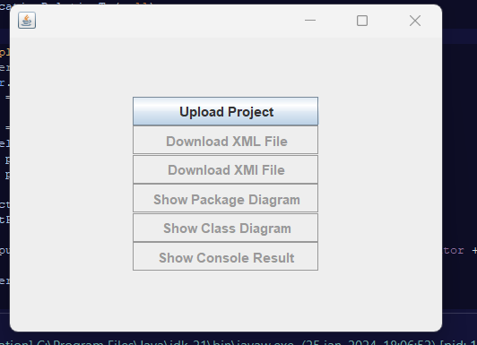
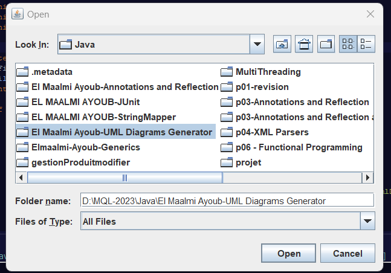
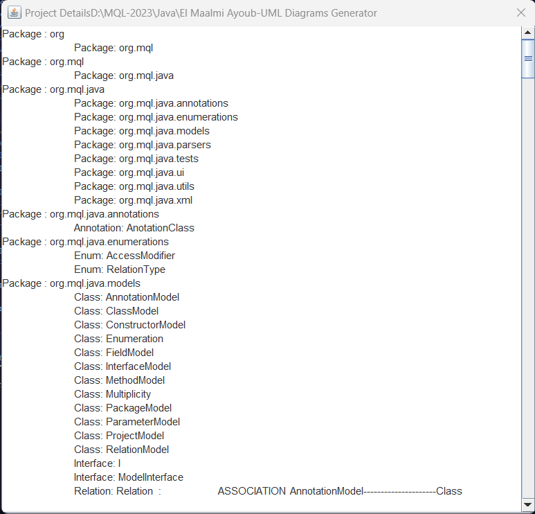
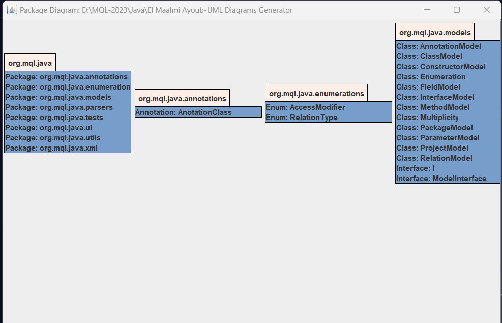

UML-Diagrams-Generator utilise la réflexion pour analyser et
représenter la structure d'autres projets Java sous forme de diagrammes UML.
Ce projet vise à automatiser la génération de diagrammes UML en extrayant les classes, 
interfaces, énumérations et annotations d'un projet Java donne .
avant tous l'utulisateur doit  choisr le fichier "ProjectUploader.java"
"/src/org/mql/java/ui/ProjectUploader.java" et lancer 
UML-Diagrams-Generator

upload button  permettre aux utilisateurs de télécharger leurs projets Java. En cliquant dessus, l'utilisateur est invité à sélectionner un répertoire de projet Java. Une fois le projet choisi, l'outil analyse la structure et les classes du projet en utilisant la réflexion Java pour extraire des informations telles que les classes, interfaces, annotations, et leurs relations

affiche le resultat de l analyse de project , il affiche tous les informations sur le project (class, interfaces , attributes...)

save xmi ou save xml 2 button pour telecharger les 2 fichier sour format xml ou xmi

ple diagrame de package generer 

